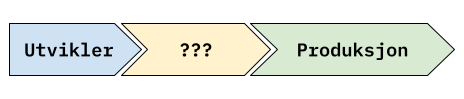
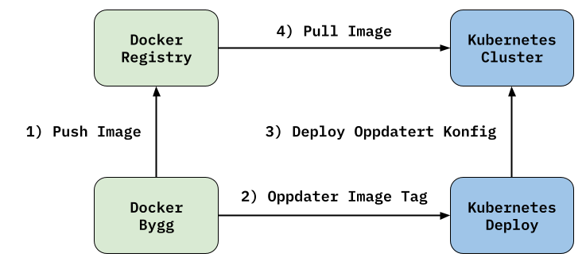
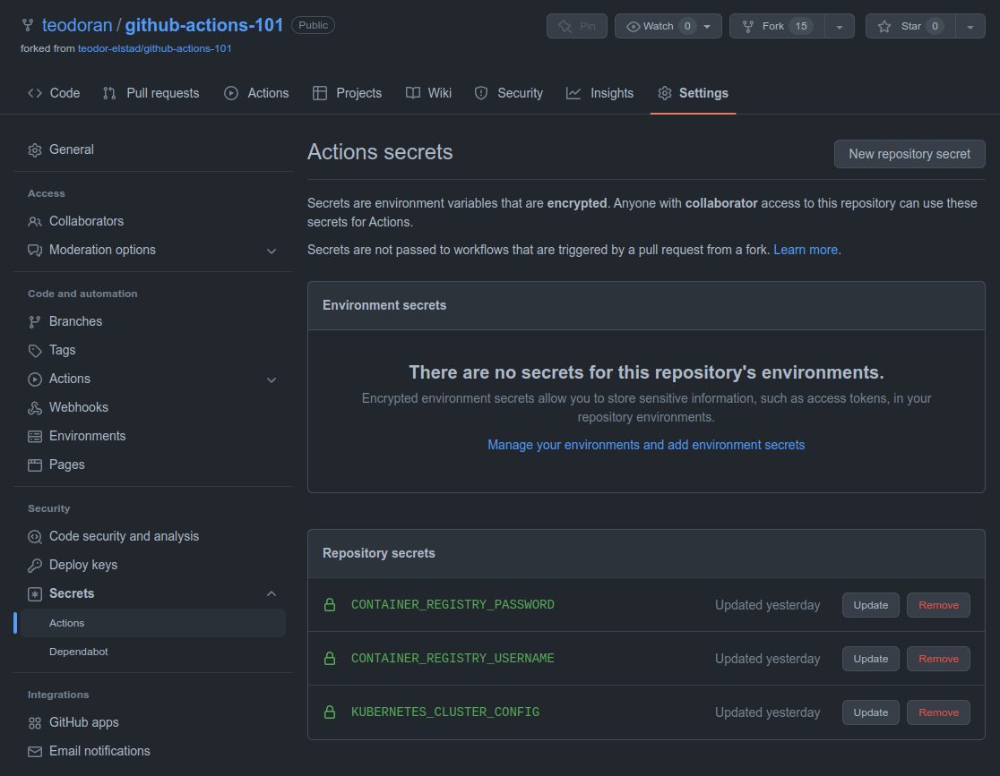
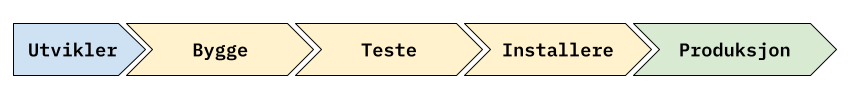

GitHub Actions 101
==================
_Et begynnerkurs i GitHub Actions, hvor du lærer å skrive en CI/CD-pipeline som bygger, tester og deployer en applikasjon._

💡 Hva er dette for noe?
------------------------
Flere ønsker å lære mer om CI/CD-verktøy generelt, og [GitHub Actions](https://docs.github.com/en/actions/learn-github-actions) spesielt. Derfor er dette kurset laget, hvor man ser på CI/CD fra A til Å, med utgangspunkt i GitHub Actions.

Dette er et begynnerkurs i GitHub Actions, og passer for deg som har jobbet lite eller ingenting med dette fra før. Her starter du med en eksempelapplikasjon, og i løpet av 2 timer får du prøve deg på å skrive en CI/CD-pipeline i GitHub Actions som bygger, tester og deployer applikasjonen. I tillegg inneholder repoet en kort presentasjon av de viktigste temaene innen CI/CD generelt.

🚦Hvordan kommer jeg i gang?
----------------------------
Før du kan kjøre applikasjonen lokalt, trenger du å installere [.NET 6.0 SDK](https://dotnet.microsoft.com/en-us/download), og et passende verktøy for å editere kode. Hvis du ikke har noen spesielle preferanser, er [Visual Studio Code](https://code.visualstudio.com/) et greit valg.

For å klone koden, trenger du [Git](https://git-scm.com/downloads). I tillegg trenger du en konto på [GitHub](https://github.com/join) for å kunne bruke [Actions](https://docs.github.com/en/actions/learn-github-actions).

Når vi kommer så langt i kurset at man skal begynne å installere applikasjonen i forskjellige miljøer, trenger du [Docker](https://docs.docker.com/get-docker/) eller [Podman](https://podman.io/getting-started/installation) for å bygge containere, og [kubectl](https://kubernetes.io/docs/tasks/tools/#kubectl) for å orkestrere containerne du bygger i Kubernetes.

🐙 Kort om CI/CD
----------------
For at applikasjonene vi lager skal kunne brukes av noen andre enn oss, må vi typisk få de ut et eller annet sted hvor noen andre enn oss kan bruke de. Dette andre stedet kaller vi gjerne produksjon, og på veien ut kan det skje mye rart.



_**Spørsmål:** Hva må til for at en applikasjon vi har laget kommer seg ut i produksjon?_

### En ordliste for CI/CD
- **CI:** Kontinuering Integrering (Continuous Integration). Praksis hvor man forsøker å samle kode-endringer fra flere bidragsytere hyppig, ved å automatisk merge inn og teste små endringer kontinuerlig.
- **CD:** Kontinuerlig Leveranse (Continuous Delivery). Tilnærming hvor man blant annet ønsker å redusere risiko for alvorlige feil i produksjon, ved å levere hyppige små endringer.
- **CI/CD-pipeline:** Den automatiske prosessen kode må igjennom for å komme seg fra en utvikler til produksjon.
- **Ressurs:** Noe som applikasjonen vår er avhengig av for å kjøre. Noen typiske eksempler er: En datamaskin (eller tilsvarende) som kan kjøre den ferdige applikasjonen vår. Databaser, køer og filer for å holde på tilstand. Nettverk for å snakke med omverdenen. Andre applikasjoner som vår applikasjon bruker.
- **Delte ressurser:** Ressurser som brukes av andre applikasjoner enn den applikasjonen vi jobber med. Dette eksempelvis være delte servere, nettverk, byggesystemer, API, med mer.
- **Miljø:** En samling av alle ressursene som trengs for å kjøre applikasjonen vi jobber med. Det miljøet som brukerne av applikasjonen bruker, kalles typisk produksjon. Andre viktige miljøer er testmiljøer, som brukes for å sjekke at nye versjoner av applikasjonen fungerer før de installers i produksjonsmiljøet, og lokalt miljø, som brukes av utviklere for å sjekke at applikasjonen fungerer mens man utvikler.
- **Infrastruktur:** Samlingen av alle ressursene og miljøene en applikasjon bruker.
- **Infrastruktur som Kode:** En tilnærming hvor man automatiserer oppsett av infrastruktur ved å uttrykke den som kode.

_**Spørsmål:** Har du hørt noen andre rare CI/CD-ord du lurer på hva betyr? Er det forklaringer i ordlisten over du er uenig i?_

🎬 Litt om GitHub Actions
-------------------------
Actions er et verktøy for å bygge CI/CD-pipelines. Det er tilgjengelig direkte i GitHub, og settes opp ved at man legger inn spesielle YAML-filer i mappen `.github/workflows`.

Hver fil definerer en [workflow](https://docs.github.com/en/actions/learn-github-actions/understanding-github-actions#workflows). En workflow er en automatisk prosess som vi ønsker at skal kjøre når en spesiell hendelse skjer. Dette kan eksempelvis være at man bygger og tester koden automatisk når det kommer inn nye endringer i en pull-request, eller at man bygger, tester og installerer koden i et miljø når nye endringer kommer inn på main-branchen i repoet.

Hendelsene som starter en workflow kaller vi en [event](https://docs.github.com/en/actions/learn-github-actions/understanding-github-actions#events). Dette er ofte hendelser knyttet til koderepoet, f.eks. at ny kode kommer inn på en spesiell branch, eller at noe nytt skjer i en pull-request, men det kan også være at man manuelt kan lage en event, eller at man kan trigge eventer jevnlig, for f.eks. å oppdatere pakker som applikasjonen er avhengig av.

Hver workflow består av en eller flere [jobber](https://docs.github.com/en/actions/learn-github-actions/understanding-github-actions#jobs), som igjen kan bestå av ett eller flere steg. Eksempelvis kan man ha en jobb som bygger applikasjonen, som igjen innholder ett steg som installerer pakker som applikasjonen trenger, og ett steg som kjører en kommando for å bygge koden.

For å gjøre det lettere å lage worksflows som trenger å gjennomføre komplekse, men mye brukte oppgaver, kan man bruke [actions](https://docs.github.com/en/actions/learn-github-actions/understanding-github-actions#actions). Det finnes mange [ferdige actions](https://docs.github.com/en/actions/learn-github-actions/finding-and-customizing-actions) man kan bruke, og man kan [lage sine egne actions](https://docs.github.com/en/actions/creating-actions) hvis man trenger det.

Når en workflow skal kjøre, trenger den et sted å kjøre. Dette kaller man [runners](https://docs.github.com/en/actions/learn-github-actions/understanding-github-actions#runners). GitHub leverer noen ferdige runnere som man kan bruke, og det går også ann å sette opp sine egne.

### Hei på deg GitHub Actions!
Start med å forke repoet [github-actions-101](https://github.com/teodor-elstad/github-actions-101), sånn at du får en kopi av repoet knyttet til din egen GitHub-bruker. Deretter er det bare å klone din kopi av repoet lokalt på maskinen din.

Lag en fil som heter `hello-actions.yml` under mappen `.github/workflows`. Lim in koden under, og sjekk den inn. Gå til Actions-fanen i din klone av "github-actions-101"-repoet, og se hva som skjer her.

```yaml
name: "Hello Actions!"

on:
  workflow_dispatch:
  push:

jobs:
  say-hello:
    runs-on: ubuntu-latest
    steps:
      - name: "Echo Greeting"
        run: "echo 'Hei på deg GitHub Actions!'"
      - name: "Echo Goodnight"
        run: "echo 'Natta!'"
```

[YAML](https://en.wikipedia.org/wiki/YAML)-koden over, definerer en workflow med navnet "Hello Actions!". Den er satt opp til å trigge (`on:`) når en av to eventer skjer: Enten hvis workflowen blir startet manuelt fra grensesnittet til GitHub (`workflow_dispatch:`), eller hvis det pushes en commit til koderepoet (`push:`).

Når workflowen kjører, starter den en jobb som heter `say-hello`. Denne jobben kjører på en maskin som har en nyere versjon av operativsystemet [Ubuntu](https://ubuntu.com/) installert. Selve jobben består av to steg. Det første steget heter "Echo Greeting", og det bruker kommandoen [echo](https://linux.die.net/man/1/echo) til å printe teksten _Hei på deg GitHub Actions!_ til terminalen. Det andre steget ligner veldig på det første, men printer i stedet teksten _Natta!_.

_**Oppgave:** Klarer du å utvide workflowen over med ett steg til som kjører en annen valgfri kommando?_

_**Tips:** Når du er ferdig med denne oppgaven, kan det være lurt å fjerne `push:`-triggeren, så workflowen "Hello Actions!" ikke kjører hele tiden resten av kurset._

🏗️ Vi bygger og tester Notes.Api
--------------------------------
Nå skal vi ta i bruk GitHub Actions til å lage en enkel workflow som bygger og tester _Sticky Notes_-applikasjonen som finnes i dette repoet. En slik workflow er ofte et viktig steg i en større CI/CD-pipeline, og den kjøres gjerne før man merger inn ny kode i repoet, ofte som en del av en pull request prosess. Målet er å finne ut om applikasjonen fremdeles bygger og ser ut til å fungere som den skal.

### Hvordan tester man Notes.Api lokalt?
Siden CI/CD-pipelines i stor grad bare er en litt avansert skript som kjører en serie med terminal-kommandoer, og GitHub Actions langt på vei bare er et verktøy som gjør det lettere å skrive sånne skript, er det ofte lurt å starte prosessen med å utvikle en ny workflow lokalt i sin egen terminal. Har man god oversikt over hvilke kommandoer man trenger å kjøre lokalt, for å få til det man ønsker, blir det ofte mye lettere å utvikle selve workflowen etterpå. Vi starter derfor denne seksjonen av kurset, med å se på hvordan man kan bygge og teste _Sticky Notes_-applikasjonen lokalt.

_Sticky Notes_ er en applikasjon som er utviklet med [.NET](https://dotnet.microsoft.com/en-us/), så derfor kommer vi til å bruke terminal-programmet [.NET CLI](https://learn.microsoft.com/en-us/dotnet/core/tools/) for å installere avhengigheter, bygge og teste applikasjonen.

#### Installasjon av avhengigheter
Man kan bruke kommandoen [`dotnet restore`](https://learn.microsoft.com/en-us/dotnet/core/tools/dotnet-restore) for å installere avhengigheter i .NET-applikasjoner. Disse avhengighetene, sammen med annen bygg-relevant informasjon, er satt opp i prosjektfiler, som har fil-endelsen `.csproj`. Vi kan kjøre kommandoen under for å restore alle avhengighetene i test-prosjektet `Notes.Api.Test`.

```shell
github-actions-101$> dotnet restore Notes.Api.Test/Notes.Api.Test.csproj
  Determining projects to restore...
  Restored /github-actions-101/Notes.Api/Notes.Api.csproj (in 220 ms).
  Restored /github-actions-101/Notes.Api.Test/Notes.Api.Test.csproj (in 257 ms).
```

Legg merke til hvordan vi også restoret avhengighetene i selve API-prosjektet `Notes.Api`. Dette skjedde fordi test-prosjektet `Notes.Api.Test` er avhengig av `Notes.Api`-prosjektet.

#### Bygging
For å bygge test-prosjektet bruker vi kommandoen [`dotnet build`](https://learn.microsoft.com/en-us/dotnet/core/tools/dotnet-build). Her har vi også lyst til å bruke flagget `--configuration Release`, som forteller .NET CLI at vi har lyst til å bygge optimalisert for kjøring/release i et miljø, og ikke for debugging, som typisk er tilfellet når vi utvikler lokalt. I tillegg har vi lyst til å bruke flagget `--no-restore`, som forteller .NET CLI at vi ikke trenger å sjekke om det må installeres noen avhengigheter først, siden vi akkurat restoret prosjektet.

```shell
github-actions-101$> dotnet build --no-restore --configuration Release Notes.Api.Test/Notes.Api.Test.csproj
Microsoft (R) Build Engine version 17.0.1+b177f8fa7 for .NET
Copyright (C) Microsoft Corporation. All rights reserved.

  Notes.Api -> /home/teodoran/nrk/github-actions-101/Notes.Api/bin/Release/net6.0/Notes.Api.dll
  Notes.Api.Test -> /home/teodoran/nrk/github-actions-101/Notes.Api.Test/bin/Release/net6.0/Notes.Api.Test.dll

Build succeeded.
    0 Warning(s)
    0 Error(s)

Time Elapsed 00:00:02.37
```

Igjen ser vi at vi ved å bygge `Notes.Api.Test` også bygget `Notes.Api`, fordi test-prosjektet er avhengig av selve API-prosjektet.

#### Kjøring av testene
For å kjøre selve testene bruker vi kommandoen [`dotnet test`](https://learn.microsoft.com/en-us/dotnet/core/tools/dotnet-test). Igjen skal vi bruke flagget `--configuration Release`, og i tillegg flagget `--no-build`, som forteller test-kommandoen at man ikke trenger å sjekke om test-prosjektet må bygges før testene kjører.

```shell
github-actions-101$> dotnet test --no-build --configuration Release Notes.Api.Test/Notes.Api.Test.csproj
Test run for /home/teodoran/nrk/github-actions-101/Notes.Api.Test/bin/Release/net6.0/Notes.Api.Test.dll (.NETCoreApp,Version=v6.0)
Microsoft (R) Test Execution Command Line Tool Version 17.0.0+68bd10d3aee862a9fbb0bac8b3d474bc323024f3
Copyright (c) Microsoft Corporation.  All rights reserved.

Starting test execution, please wait...
A total of 1 test files matched the specified pattern.

Passed!  - Failed:     0, Passed:     9, Skipped:     0, Total:     9, Duration: 265 ms - /home/teodoran/nrk/github-actions-101/Notes.Api.Test/bin/Release/net6.0/Notes.Api.Test.dll (net6.0)
```

Ni tester passerte! Neppe den mest omfattende test-suiten, men godt nok for det vi skal gjøre i dag.

#### Generering av testresultater
Kommandoen `dotnet test` kan kjøres med flere andre nyttige flagg. Eksempelvis kan flagget `--verbosity` brukes for å styre hvor mye informasjon testene skal printe til terminalen, og flagget `--logger` kan brukes for å få generert en fil som inneholder testresultatene (dette kan vise seg å være nyttig senere).

```shell
github-actions-101$> dotnet test \
                        --no-build \
                        --configuration Release \
                        --verbosity normal \
                        --logger trx \
                        Notes.Api.Test/Notes.Api.Test.csproj
Build started 10/18/2022 8:43:17 PM.
Test run for /github-actions-101/Notes.Api.Test/bin/Release/net6.0/Notes.Api.Test.dll (.NETCoreApp,Version=v6.0)
Microsoft (R) Test Execution Command Line Tool Version 17.0.0+68bd10d3aee862a9fbb0bac8b3d474bc323024f3
Copyright (c) Microsoft Corporation.  All rights reserved.

Starting test execution, please wait...
A total of 1 test files matched the specified pattern.
Results File: /github-actions-101/Notes.Api.Test/TestResults/_HAL_2022-10-18_20_43_20.trx

Passed!  - Failed:     0, Passed:     9, Skipped:     0, Total:     9, Duration: 268 ms - /home/teodoran/nrk/github-actions-101/Notes.Api.Test/bin/Release/net6.0/Notes.Api.Test.dll (net6.0)

Build succeeded.
    0 Warning(s)
    0 Error(s)

Time Elapsed 00:00:02.21
```

Etter at du har kjørt kommandoen, kan du ta en titt på `.trx`-filen som ble generert i mappen `/github-actions-101/Notes.Api.Test/TestResults/`. Mye XML her, men kanskje det finnes noe som kan vise frem innholdet av filen på en fin måte?

_**Tips:** På noen plattformer kan man bryte ned lange kommandoer over flere linjer ved å bruke `\` på slutten av hver linje. Dette kan gjøre kommandoene lettere å lese. Hvis dette ikke fungerer i din terminal, kan du bare gjøre om kommandoen i eksempelet over til en lang linje._

### Restore, bygg og test i en workflow
Nå som vi har god oversikt over hva som skal til for å restore, bygge og teste en .NET-applikasjon, gjenstår det bare å skrive en GitHub Actions workflow som gjør det samme som vi akkurat har gjort i terminalen.

Du kan ta utgangspunkt i workflowen under, ved å legge den inn i en fil som f.eks. heter `hello-dotnet.yml` under mappen `.github/workflows`.

```yaml
name: "Hello .NET"

on:
  workflow_dispatch:

jobs:
  build-test:
    runs-on: ubuntu-latest

    steps:
      - uses: actions/checkout@v3

      - name: "Setup .NET Core SDK"
        uses: actions/setup-dotnet@v2
        with:
          dotnet-version: "6.0.x"

      - name: "Print .NET CLI version"
        run: dotnet --version
```

Denne workflowen inneholder allerede en jobb som har tre steg:
1. [actions/checkout](https://github.com/marketplace/actions/checkout) er en ferdig action, som sjekker ut koden vi har i repoet på maskinen jobben kjører på. Dette er en mye brukt action!
2. [actions/setup-dotnet](https://github.com/marketplace/actions/setup-net-core-sdk) installerer .NET CLI på maskinen, sånn at kommandoen `dotnet` er tilgjengelig for de neste stegene i jobben.
3. Til slutt kjører vi et steg som viser at vi har .NET CLI tilgjengelig ved å kjøre kommandoen `dotnet --version`.

_**Oppgave 1:** Legg til tre steg i workflowen over som restorer, bygger og kjører testene i `Notes.Api.Test`._

_**Oppgave 2:** Man kan bruke [miljøvariabler i GitHub Actions](https://docs.github.com/en/actions/learn-github-actions/environment-variables) til f.eks. å samle verdier som brukes flere steder i en workflow. Klarer du å lage en miljøvariabel med banen til test-prosjektet (`Notes.Api.Test/Notes.Api.Test.csproj`) som kan gjenbrukes i de forskjellige stegene?_

_**Oppgave 3:** `dorny/test-reporter` er en ferdig action som kan brukes til å vise frem testresultater. Klarer du å legge til et steg på slutten av jobben som bruker denne action til å vise frem `.trx`-testresultatene som `dotnet test` produserer?_

_**Tips:** Hvis du står fast på en av oppgavene over, er det bare å be om hjelp, eller ta en titt på eksempel-løsningen [her](https://github.com/teodoran/github-actions-101/blob/main/.github/workflows/hello-dotnet.yml)._

_**Info:** Man kan bruke [GitHub Actions Marketplace](https://github.com/marketplace) for å finne flere ferdige actions når du skal skrive dine egne workflows senere, men man trenger ikke flere for å løse oppgavene over._

🐋 Vi bygger og kjører en applikasjon med Docker
------------------------------------------------
Vi skal etter hvert lage en workflow som deployer `Notes.Api` med [Docker](https://www.docker.com/) og [Kubernetes](https://kubernetes.io/) (ofte bare kalt k8s). Det betyr at vi må se litt på hvordan man bruker disse verktøyene. Først ut er Docker (eller [Podman](https://podman.io/))!

_**NB:** Eksemplene under bruker kommandoen `docker`, så hvis du har valgt å installere `podman`, må du bruke `podman` i stede for `docker` når du kjører eksemplene._

### Hva er Docker?
Docker er en teknologi som lar oss pakke sammen programmer og en forenklet virtuell datamaskin til noe man kaller en container. Det er litt som at man i stede for å levere et dataprogram som må installeres på en annen maskin før man kan bruke det, leverer dataprogrammet ferdig installert på en datamaskin.

Container-teknologi, som Docker er et eksempel på, har flere fordeler:
- Man kan utvikle applikasjoner med mange forskjellige teknologier, men ved å putte de i en container, kan alle de forskjellige applikasjonene kjøres med samme teknologi, som bare trenger å vite hvordan man kjører en container.
- Man får større kontroll over datamaskinen applikasjonen kjører på i alle miljøer, siden denne datamaskinen i stor grad er pakket sammen med applikasjonen.
- Sammenlignet med tradisjonelle virtuelle datamaskiner (eller vanlige datamaskiner for den saks skyld), er containere mye enklere å overføre mellom forskjellige datamaskiner, og er lettere å bruke i en CI/CD-pipeline.

### Hva er et image?
For å lage en container, trenger man en mal. Denne malen kalles et image, og representerer et øyeblikksbilde av containeren etter at alle stegene i en gitt oppskriften er fulgt. Oppskriften kaller man gjerne en Dockerfile. En Dockerfile kan f.eks. inneholde stegene:
1. Start med et image Microsoft har laget, som inneholder operativsystemet Ubuntu med .NET CLI ferdig installert.
2. Kopier inn koden til applikasjonen vår, og bygg denne med .NET CLI.
3. Start den ferdig bygde applikasjonen vår.

Hvis man bygger et image fra denne oppskriften, vil man ende opp med et image som inneholder en spesifikk versjon av applikasjonen vår, basert på den koden som ble kopiert inn i imaget da oppskriften ble kjørt.

Sagt på en annen måte: Dockerfilen er en oppskrift som forteller oss hvordan man lager/byger et image. Hver kan man følger oppskriften, ender man opp med et image, som representerer en versjon av applikasjonen vår. Imaget kan man så senere dele og bruke til å lage containere.

### La oss leke med et image
Før vi skriver vårt eget image for applikasjonen `Notes.Api`, kan det være nyttig å leke litt med et ferdiglaget image. Et litt morsomt image å leke med, er [wernight/funbox](https://hub.docker.com/r/wernight/funbox). Dette imaget lager en container som inneholder et Linux operativsystem, hvor det er installert flere artige kommandoer som printer ut morsom tekst til terminalen. En slik kommando er [`sl`](https://manpages.ubuntu.com/manpages/bionic/man6/sl.6.html). For å kjøre denne kommandoen i containeren som bygges av wernight/funbox-imaget, kan vi kjøre følgende kommando:

```shell
$> docker run -it wernight/funbox:latest sl
```

Hva skjedde her?
- `docker run -it` forteller Docker at vi har lyst til å kjøre containeren vi lager fra imaget i "interactive mode", og at vi har lyst til å få vist frem det som printes til terminalen i containeren i vår egen terminal.
- `wernight/funbox:latest` er en referanse til et image. `wernight` er den som har publisert dette imaget, `funbox` er navnet på imaget og `latest` er versjonen. Denne referansen til et image kalles ofte en _image tag_ eller bare _tag_.
- Imaget vi lager containeren fra, forventer at vi sender med kommandoen vi vil kjøre i containeren som et argument. Derfor er det siste argumentet over `sl`, som er kommandoen vi ønsker å kjøre inne i containeren.

_**Oppgave:** Ta en titt på de andre kommandoene som finnes i wernight/funbox og prøv de ut! Hvis terminalen blir rotete, kan du tømme den med kommandoen `clear`._

### Publisering av Notes.Api med `dotnet publish`
Akkurat som når man skal skrive en workflow, er det nyttig å vite hvilke kommandoer man trenger å kjøre lokalt for å bygge og starte applikasjonen man skal skrive en Dockerfile for. Det å skrive en Dockerfile er nemlig ikke helt forskjellig fra å skrive skript det heller. Siden vi ønsker at containeren vår skal bygge og kjøre `Notes.Api`, starter vi med å ta en titt på hvordan man gjør dette lokalt med .NET CLI.

Når man skal bygge .NET-applikasjoner for leveranse og installasjon på andre maskiner, bruker man kommandoen [`dotnet publish`](https://learn.microsoft.com/en-us/dotnet/core/tools/dotnet-publish) i stede for `dotnet build`. I tillegg til blant annet å bygge applikasjonen, pakker denne kommandoen sammen alle filene den ferdig bygde applikasjonen består av, og putter de i en mappe, klare for å leveres og kjøres på en datamaskin.

```shell
github-actions-101$> dotnet publish --output ./Notes.Published --configuration Release --self-contained false Notes.Api/Notes.Api.csproj
Microsoft (R) Build Engine version 17.0.1+b177f8fa7 for .NET
Copyright (C) Microsoft Corporation. All rights reserved.

  Determining projects to restore...
  All projects are up-to-date for restore.
  Notes.Api -> /home/teodoran/nrk/github-actions-101/Notes.Api/bin/Release/net6.0/Notes.Api.dll
  Notes.Api -> /home/teodoran/nrk/github-actions-101/Notes.Published/
```

Kommandoen over publiserer `Notes.Api` til en mappe som heter `Notes.Published`. Akkurat som når vi kjørte testene, bruker vi flagget `--configuration Release` for å fortelle `dotnet publish` at vi ønsker å bygge applikasjonen for leveranse.

_Vi har i tillegg med flagget `--self-contained false`, men å gå inn på hva dette betyr, er litt utenfor scope i denne omgangen. De som er spesielt interesserte kan ta en titt på [denne oversikten](https://learn.microsoft.com/en-us/dotnet/core/deploying/)._

Nå kan vi starte den ferdig publiserte applikasjonen direkte med `dotnet`. Naviger ned i mappen `Notes.Published` og kjør følgende kommando:

```shell
github-actions-101$> cd Notes.Published/
github-actions-101/Notes.Published$> dotnet Notes.Api.dll
info: Microsoft.Hosting.Lifetime[14]
      Now listening on: http://localhost:5000
info: Microsoft.Hosting.Lifetime[14]
      Now listening on: https://localhost:5001
info: Microsoft.Hosting.Lifetime[0]
      Application started. Press Ctrl+C to shut down.
info: Microsoft.Hosting.Lifetime[0]
      Hosting environment: Development
info: Microsoft.Hosting.Lifetime[0]
      Content root path: /home/teodoran/nrk/github-actions-101/Notes.Published/
info: Microsoft.Hosting.Lifetime[0]
```

Hvis alt gikk bra, kan du åpne [http://localhost:5000/client](http://localhost:5000/client) og leke litt med _Sticky Notes_-applikasjonen. Du kan også pinge APIet direkte ved å gå til [http://localhost:5000/ping](http://localhost:5000/ping).

### Det samme i en Dockerfile
Start med å opprette en fil i mappen `Notes.Api` med navnet `Dockerfile`, og fyll den med følgende innhold:

```dockerfile
FROM mcr.microsoft.com/dotnet/sdk:6.0 AS build-stage
WORKDIR /Sources

COPY /Notes.Api ./
RUN dotnet publish --output ./Notes.Published --configuration Release --self-contained false

FROM mcr.microsoft.com/dotnet/aspnet:6.0
WORKDIR /Application
COPY --from=build-stage /Sources/Notes.Published ./
ENTRYPOINT ["dotnet", "Notes.Api.dll"]
```

Her tar vi utgangspunkt i et image fra Microsoft som inneholder et Linux-basert operativsystem, med .NET SDK v6.0 ferdig installert `FROM mcr.microsoft.com/dotnet/sdk:6.0`. Videre sier vi at vi skal jobbe i en mappe som heter `/Sources` inne i containeren vi bygger.

Deretter går vi videre med å kopiere alle filene fra mappen `/Notes.Api` inn i imaget, før vi publiserer applikasjonen med `dotnet publish`.

Helt på slutten bruker vi `ENTRYPOINT` for å si at når man starter en container basert på dette imaget, så skal vi kjøre den ferdig bygde `Notes.Api.dll` med `dotnet` direkte, men før dette skjer det noe rart. Hvorfor har vi en ny runde med `FROM` og `WORKDIR`?

Dette er et eksempel på det som kalles et [multi-stage bygg](https://docs.docker.com/build/building/multi-stage/). I multi-stage bygg, bygger vi flere imager på rad. Her bygger vi først et image med .NET SDK v6.0, som bare brukes til å publisere `Notes.Api`. Deretter går vi rett videre å bygger et nytt image basert på ASP.NET-runtime imaget til Microsoft. Dette imaget er spesialtilpasset for å kjøre ASP.NET Core applikasjoner, som er det rammeverket `Notes.Api` er bygget med. Fra det første imaget tar vi også bare med oss de ferdig publiserte filene i `/Sources/Notes.Published`. Dette betyr at vi ender opp med et mye mindre image, og i et multi-stage bygg er det bare det siste imaget vi tar vare på.

Det kan kanskje virke litt rart å trekke inn en sånn optimaliseringsteknikk i et begynnerkurs, men denne teknikken er veldig vanlig, så det kan være greit å vite hva det er snakk om, hvis man støter på det i andre dockerfiler.

_**Oppgave:** Docker [cacher viktige steg](https://docs.docker.com/develop/develop-images/dockerfile_best-practices/#leverage-build-cache) når man bygger et image, derfor kan det være nyttig å skille ut operasjoner som sjelden endrer seg i egne steg i starten av dockerfilen. På den måten får man et raskere image-bygg. Klarer du å skille ut restore av Notes.Api i et eget steg før `dotnet publish`, som bare kopierer inn `/Notes.Api/Notes.Api.csproj` og kjører `dotnet restore` på denne prosjektfilen? Hvis du står fast, er det bare å spørre om hjelp, eller ta en titt på forslaget til løsning [her](https://github.com/teodoran/github-actions-101/blob/main/Notes.Api/Dockerfile)._

_**Tips:** Man kan lage en [`.dockerignore`-fil](https://docs.docker.com/engine/reference/builder/#dockerignore-file) for å begrense hvilke filer Docker kopierer inn i imaget når man bygger det. Det kan gjøre det imaget litt kjappere å bygge, og det ferdige imaget litt mindre i størrelse._

### Bygging av et image og kjøring av en container
Med en Dockerfile på plass, kan vi bygge et image med `docker build`. Kommandoen under bygger et image basert på filen `Notes.Api/Dockerfile`, og image vi bygger tagges med `notes-api:v0`, som er referansen vi kan bruke til å kjøre containere basert på imaget senere. Helt til slutt sender vi inn banen til mappen som vi ønsker at Docker skal kopiere inn filer til imaget fra. Siden vi står i rot-mappen til repoet, blir det banen til mappen vi er i, dvs. `./`.

```shell
github-actions-101$> docker build --file Notes.Api/Dockerfile --tag notes-api:v0 ./
Sending build context to Docker daemon  148.8MB
Step 1/8 : FROM mcr.microsoft.com/dotnet/sdk:6.0 AS build-stage
 ---> c315566c49a2
Step 2/8 : WORKDIR /Sources
 ---> Using cache
 ---> ab33d5dfbc3d
Step 3/8 : COPY /Notes.Api ./
 ---> d3d412c5ebb4
Step 4/8 : RUN dotnet publish --output ./Notes.Published --configuration Release --self-contained false
 ---> Running in 453acb5ce388
MSBuild version 17.3.2+561848881 for .NET
  Determining projects to restore...
  Restored /Sources/Notes.Api.csproj (in 3.92 sec).
  Notes.Api -> /Sources/bin/Release/net6.0/Notes.Api.dll
  Notes.Api -> /Sources/Notes.Published/
Removing intermediate container 453acb5ce388
 ---> 9a160daf0848
Step 5/8 : FROM mcr.microsoft.com/dotnet/aspnet:6.0
 ---> 914094d6a4a0
Step 6/8 : WORKDIR /Application
 ---> Using cache
 ---> 4d48e7d26353
Step 7/8 : COPY --from=build-stage /Sources/Notes.Published ./
 ---> 34ed4d0be017
Step 8/8 : ENTRYPOINT ["dotnet", "Notes.Api.dll"]
 ---> Running in 07fa0d7271c1
Removing intermediate container 07fa0d7271c1
 ---> eeeaf97b375e
Successfully built eeeaf97b375e
Successfully tagged notes-api:v0
```

Nå kan vi kjøre opp en container baser på imaget `notes-api:v0` med `docker run`.

```shell
$> docker run -it -p 8000:80 notes-api:v0
info: Microsoft.Hosting.Lifetime[14]
      Now listening on: http://[::]:80
info: Microsoft.Hosting.Lifetime[0]
      Application started. Press Ctrl+C to shut down.
info: Microsoft.Hosting.Lifetime[0]
      Hosting environment: Production
info: Microsoft.Hosting.Lifetime[0]
      Content root path: /Application/
```

Som før bruker vi flagget `-it`, i tillegg bruker vi flagget `-p 8000:80` for å fortelle Docker at vi ønsker at man skal sende all HTTP-trafikk fra vår maskin på port 8000 til port 80 i containeren. Hvis alt går bra, skal det være mulig å åpne [http://localhost:8000/client/](http://localhost:8000/client/) og [http://localhost:8000/ping](http://localhost:8000/ping), som når _Sticky Notes_-applikasjonen kjørte direkte på vår maskin.

### Deling av et image
Det er fint å ha et image man kan kjøre lokalt på vår maskin, men målet er å dele dette imaget, sånn at det også kan kjøre på en annen maskin. For å gjøre dette må vi laste imaget opp til et container-register.

Et container-register er i korte trekk en tjeneste som kan ta vare på og dele videre ferdig bygde imager. Man kan se litt på det som en filserver, eller et pakke-register for programvare. For å dele et image via et container-register, er det et par ting som må være på plass:
1. Man må være logget på container-registrert man ønsker å bruke.
2. Imaget man skal dele må være tagget på en passende måte.
3. Man må pushe imaget opp til registeret med kommandoen `docker push`.

For denne workshoppen er det satt opp et container-register i Azure som heter `devops101registry.azurecr.io`. Dette er registeret vi skal bruke videre i kurset.

#### Logg inn på container-registeret
Før vi kan pushe docker-imager til registeret `devops101registry.azurecr.io`, må vi logge inn med `docker`. Kjør kommandoen under, og logg på med [dette brukernavnet](https://nrkconfluence.atlassian.net/wiki/spaces/PTU/pages/106109005/GitHub+Actions+101+kurs+h+st+2022#CONTAINER_REGISTRY_USERNAME) og [dette passordet](https://nrkconfluence.atlassian.net/wiki/spaces/PTU/pages/106109005/GitHub+Actions+101+kurs+h+st+2022#CONTAINER_REGISTRY_PASSWORD).

```shell
$> docker login devops101registry.azurecr.io
Username: devops101registry
Password:

WARNING! Your password will be stored unencrypted ...

Login Succeeded
```

Hvis alt gikk som det skulle, skal den siste meldingen fra kommandoen være "Login Succeeded".

_Får du en advarsel om at passordet kommer til å lagres ukryptert, er det bare å se bort ifra denne._

#### Tagg imaget på en passende måte
Imager som skal lastes opp til registeret vi bruker i dette kurset, må ha en tag som starter på `devops101registry.azurecr.io`. I tillegg må taggen inneholde noe som er unikt for deg som kursdeltaker, da alle deltakerne sine imager havner i samme register. Husk derfor å bytte ut `[DITT BRUKERNAVN]` i kommandoen under med noe passende, sånn at du ender opp med en image tag som er spesifikk for deg, f.eks. noe i retning av `devops101registry.azurecr.io/tae-notes-api:v0`.

```shell
$> docker tag notes-api:v0 devops101registry.azurecr.io/[DITT BRUKERNAVN]-notes-api:v0
```

#### Push imaget opp til registeret
Da gjenstår det bare å pushe imaget opp til container-registeret med `docker push`.

```shell
$> docker push devops101registry.azurecr.io/[DITT BRUKERNAVN]-notes-api:v0
The push refers to repository [devops101registry.azurecr.io/tae-notes-api]
c06c1058259d: Pushed
95f8cee92fd0: Mounted from notes-api
619c49f548ce: Mounted from notes-api
dc392f0ae18a: Mounted from notes-api
b00c9e3dc8e6: Mounted from notes-api
aa8b36ac3266: Mounted from notes-api
fe7b1e9bf792: Mounted from notes-api
v0: digest: sha256:01f9cc95675c9452ccff266f4658999f34ab6c0ef517d681ad8ef9b955091028 size: 1790
```

Hvis alt gitt bra, er du klar til å gå over til å se litt på Kubernetes.

_**Tips:** Hvis du er usikker på om imaget ditt ble lastet opp til container-registeret, kan du spørre kursholder om vedkommende ser det i registeret._

⎈ Vi deployer en applikasjon til Kubernetes
--------------------------------------------
[Kubernetes](https://kubernetes.io/) er et populært verktøy for å kjøre containere. I tillegg til funksjonalitet for å kjøre kontainere, inneholder det masse andre ting, som muligheten til å skalere opp og ned antallet containere en applikasjon består av, verktøy for å sette opp nettverk mellom containerne, og mye mer. Dette kurset har ikke som mål å gi en grundig introduksjon til Kubernetes, til dette anbefales [Team Utvikleropplevelse sitt Kubernetes-kurs nå i november](https://nrkconfluence.atlassian.net/l/cp/jrfvpsJV). Her kommer vi bare til å dekke det helt minimale man trenger å kunne for å sette opp en GitHub Actions workflow som deployer `Notes.Api` til Kubernetes.

Til dette kurset er det også satt opp et Kubernetes-cluster som heter `devops-101-cluster`. Dette er clusteret vi kommer til å jobbe videre med i kurset.

### Konfigurer kubectl med tilgang til devops-101-cluster
For å kunne jobbe med Kubernetes-clusteret `devops-101-cluster`, må vi konfigurere `kubectl`. Konfigurasjonen vi trenger finner du [her](https://nrkconfluence.atlassian.net/wiki/spaces/PTU/pages/106109005/GitHub+Actions+101+kurs+h+st+2022#KUBERNETES_CLUSTER_CONFIG).

Det er flere måter man kan få `kubectl` til å bruke denne konfigurasjonen på:
1. Man kan lagre konfigurasjonen i en egen fil, og bruke argumentet `--kubeconfig` til å fortelle `kubectl` at man skal bruke denne konfigurasjonen: `kubectl get pods --kubeconfig ~/devops-101-config.yaml`. Hvis man velger denne løsningen, må man huske å legge på argumentet `--kubeconfig` på alle `kubectl`-kommandoer man kjører videre i kurset.
2. Man kan flette inn elementene fra `clusters`, `contexts` og `users` i `kubectl` sin default konfigurasjonsfil (ofte kalt kubeconfig-filen), som er `~/.kube/config` på Linux og Mac, og `%USERPROFILE%\.kube\config` på Windows. Flettingen gjør man ved å åpne kubeconfig-filen i en teksteditor, og klippe inn de forskjellige delene der de hører hjemme. I tillegg må man oppdatere `current-context` til `devops-101-cluster`.
3. Man kan lagre konfigurasjonen i en egen fil, og så [opprette miljøvariabelen](https://kubernetes.io/docs/tasks/access-application-cluster/configure-access-multiple-clusters/#set-the-kubeconfig-environment-variable) `KUBECONFIG`, med en bane til denne (og flere) konfigurasjonsfiler. Dette er ofte den mest praktiske løsningen hvis man jobber mye med forskjellige konfigurasjoner, men kan være den mest omstendelige løsningen å sette opp.

Velg en av metodene over for å konfigurere `kubectl` til å nå `devops-101-cluster`. Når du har gjort dette, skal du kunne hente alle poddene som kjører i navnerommet `kube-system`, og få et svar litt som vist under:
```shell
$> kubectl get pods --namespace kube-system
NAME                                  READY   STATUS    RESTARTS   AGE
azure-ip-masq-agent-9g24h             1/1     Running   0          14h
cloud-node-manager-ztb2l              1/1     Running   0          14h
coredns-autoscaler-5589fb5654-sknvl   1/1     Running   0          14h
coredns-b4854dd98-56fgr               1/1     Running   0          14h
coredns-b4854dd98-fzf48               1/1     Running   0          14h
csi-azuredisk-node-8cshv              3/3     Running   0          14h
csi-azurefile-node-kxl6c              3/3     Running   0          14h
konnectivity-agent-cb784597d-b55lq    1/1     Running   0          14h
konnectivity-agent-cb784597d-wxwql    1/1     Running   0          14h
kube-proxy-n45m4                      1/1     Running   0          14h
metrics-server-f77b4cd8-crwl9         1/1     Running   0          14h
metrics-server-f77b4cd8-jq29q         1/1     Running   0          14h
```

### Kubernetes-konfigurasjon for Notes.Api
For at Kubernetes skal skjønner hvordan man kjører `Notes.Api`, må vi skrive litt Kubernetes-konfigurasjon.

Start med å opprette en fil i mappen `Notes.Api` med navnet `Kubernetes.yaml`, og fyll den med følgende innhold, hvor du erstatter `[DITT BRUKERNAVN]` med noe passende for deg, sånn at du ender opp med f.eks. `tae-notes-api` og samme image tag som du har brukt tidligere:

```yaml
apiVersion: apps/v1
kind: Deployment
metadata:
  name: [DITT BRUKERNAVN]-notes-api
spec:
  replicas: 1
  selector:
    matchLabels:
      app: [DITT BRUKERNAVN]-notes-api
  template:
    metadata:
      labels:
        app: [DITT BRUKERNAVN]-notes-api
    spec:
      imagePullSecrets:
        - name: devops101registry-credentials
      containers:
        - name: notes-api
          image: devops101registry.azurecr.io/[DITT BRUKERNAVN]-notes-api:v0
          imagePullPolicy: Always
          ports:
            - containerPort: 80
---
apiVersion: v1
kind: Service
metadata:
  name: [DITT BRUKERNAVN]-notes-api
spec:
  type: LoadBalancer
  selector:
    app: [DITT BRUKERNAVN]-notes-api
  ports:
    - protocol: TCP
      port: 80
```

Denne konfigurasjonen inneholder i hovedsak to ting. Ett deployment som forteller Kubernetes hvordan vi vil at man skal lage containere basert på imaget vårt. Her er det blant annet spesifisert at man ønsker en instans/replika av containeren, og vi forteller Kubernetes hvilke image tag man kan bruke for å hente imaget.

I tillegg setter vi opp en service, som forteller Kubernetes hvordan HTTP-trafikk til clusteret skal rutes videre til containerne som deploymenten setter opp.

### Deploy av Notes.Api til Kubernetes
Med Kubernetes-konfigurasjonen på plass, kan vi deploye `Notes.Api` til Kubernetes med `kubectl apply`.

```shell
$> kubectl apply --filename Notes.Api/Kubernetes.yaml
deployment.apps/[DITT BRUKERNAVN]-notes-api created
service/[DITT BRUKERNAVN]-notes-api created
```

Hvis `kubectl apply` kjørte uten feil, kan vi se litt på hva som kom inn i clusteret. La oss først ta en titt på deploymentene i clusteret.

```shell
$> kubectl get deployments
NAME            READY   UP-TO-DATE   AVAILABLE   AGE
...
[DITT BRUKERNAVN]-notes-api   1/1     1            1           68s
```

Her finner man deploymenten som vi har konfigurert opp, og man kan bruke `kubectl describe deployment [DITT BRUKERNAVN]-notes-api` for å få flere detaljer om den.

Deploymenten starter noe som kalles pods. Dette er hva som faktisk kjører containeren vår i Kubernetes.

```shell
$> kubectl get pods
NAME                            READY   STATUS    RESTARTS   AGE
...
[DITT BRUKERNAVN]-notes-api-f5784ddbf-28cfk   1/1     Running   0          111s
```

_**Oppgave 1:** Forsøk å slette podden din med `kubectl delete pod [NAVN PÅ POD]`. Hva ser du når du kjører `kubectl get pods` igjen?_

Til slutt kan vi ta en titt på servicen som ble satt opp.

```shell
$> kubectl get services
NAME                          TYPE           CLUSTER-IP     EXTERNAL-IP    PORT(S)        AGE
kubernetes                    ClusterIP      10.0.0.1       <none>         443/TCP        29h
...
[DITT BRUKERNAVN]-notes-api   LoadBalancer   10.0.106.98    20.76.158.49   80:31338/TCP   34s
```

Her kan vi se at servicen har fått en ekstern IP-adresse. Denne kan vi bruke for å nå _Sticky Notes_-applikasjonen som kjører på clusteret. Hvis du åpner [http://[DIN EXTERNAL-IP]/client](http://20.76.158.49/client/) og [http://[DIN EXTERNAL-IP]/ping](http://20.76.158.49/ping), skal du se det samme som du så når applikasjonen kjørte lokalt.

_**Oppgave 2:** I Kubernetes-konfigurasjonen er det `replicas:` i deploymentet som styrer hvor mange instanser av Notes.Api man starter opp. Klarer du å skalere opp din versjon av Notes.Api til to instanser? Hva skjer når du forsøker å bruke Notes.Api når det er mer enn en instans som kjører?_

🚀 Vi bygger en workflow som deployer Notes.Api
-----------------------------------------------
Nå som vi kjenner litt til både Docker og Kubernetes, er vi klar til å lage en GitHub Actions workflow som:
1. Bygger et image fra `Notes.Api/Dockerfile`, og pusher det opp til container-registeret `devops101registry.azurecr.io`, med en image-tag som er unik for denne kjøringen av workflowen.
2. Oppdaterer `Notes.Api/Kubernetes.yaml` med taggen til det ny-byggede imaget.
3. Deployer den oppdaterte Kubernetes-konfigurasjonen til `devops-101-cluster`
4. Sånn at Kubernetes kan hente ned det nye imaget fra container-registeret, og kjøre opp applikasjonen vår.



### Kort om hemmeligheter i GitHub Actions
Actions kan hente hemmeligheter som er konfigurert under _Settings -> Actions -> Repository secrets_. For at workflowen vi lager skal kunne logge seg på container-registeret og kubernetes-clusteret, trenger vi derfor å sette opp [de samme hemmelighetene](https://nrkconfluence.atlassian.net/wiki/spaces/PTU/pages/106109005/GitHub+Actions+101+kurs+h+st+2022#%F0%9F%94%90-N%C3%B8kler-til-bruk-under-kurset) her som vi har brukt ellers i kurset.



Disse hemmelighetene vil vi da kunne hente ut i en workflow med syntaksen `${{ secrets.CONTAINER_REGISTRY_USERNAME }}`, `${{ secrets.CONTAINER_REGISTRY_PASSWORD }}` og `${{ secrets.KUBERNETES_CLUSTER_CONFIG }}`.

### En workflow for deploy
For å få på plass en workflow som både bruker Docker og deployer til Kubernetes, kommer vi til å bruke flere ferdiglagde actions:
- [docker/login-action](https://github.com/marketplace/actions/docker-login), som logger `docker` inn på container-registeret `devops101registry.azurecr.io`.
- [docker/build-push-action](https://github.com/marketplace/actions/build-and-push-docker-images), som bygger og pusher Docker images, og som er avhengig av at action [docker/setup-buildx-action](https://github.com/marketplace/actions/docker-setup-buildx) er kjørt først.
- [azure/setup-kubectl](https://github.com/marketplace/actions/kubectl-tool-installer) som installerer `kubectl`.
- [azure/k8s-set-context](https://github.com/marketplace/actions/kubernetes-set-context) som konfigurerer `kubectl` til å bruke kubeconfig-filen vi har lagt inn i _Repository secrets_.
- [azure/k8s-deploy](https://github.com/marketplace/actions/deploy-to-kubernetes-cluster) som deployer oppdatert Kubernetes-konfigurasjon til `devops-101-cluster`.

Under er en mangelfull workflow du kan ta utgangspunkt i, ved å legge den inn i en fil som f.eks. heter `hello-deploy.yml` under mappen `.github/workflows`.

```yaml
name: "Hello Deploy"

on:
  workflow_dispatch:

jobs:
  build:
    runs-on: ubuntu-latest

    steps:
      - uses: actions/checkout@v3

      - name: "Login to container registry"
        uses: docker/login-action@v2
        with:
          registry: devops101registry.azurecr.io
          username: [HVA MANGLER HER?]
          password: [HVA MANGLER HER?]

      - name: "Set up Docker Buildx"
        uses: docker/setup-buildx-action@v2

      - name: Build and push
        uses: docker/build-push-action@v3
        with:
          [HER MANGLER FLERE LINJER]

  deploy:
    runs-on: ubuntu-latest
    needs: build

    steps:
      - uses: actions/checkout@v3

      - uses: azure/setup-kubectl@v3

      - uses: azure/k8s-set-context@v1
        with:
          method: kubeconfig
          kubeconfig: [HVA MANGLER HER?]
          context: devops-101-cluster

      - uses: Azure/k8s-deploy@v3.1
        with:
          [HER MANGLER FLERE LINJER]
```

_**Oppgave:** Fyll inn det som mangler i workflowen over, sånn at du kan kjøre den fra GitHub og deploye nye versjoner av `Notes.Api`. Hvis du står fast, er det bare å spørre om hjelp, eller ta en titt på forslaget til løsning [her](https://github.com/teodoran/github-actions-101/blob/main/.github/workflows/hello-deploy.yml)._

_**Tips:** For å lage en image-tag som er unik for hver kjøring av workflowen, kan det være nyttig å bruke miljøvariabelen `github.run_number` sånn at image-taggen man bruker i workflowen er noe i retning av `devops101registry.azurecr.io/notes-api:v${{ github.run_number }}`._

🔗 Vi knytter sammen workflows til en CI/CD-pipeline
----------------------------------------------------
Helt til slutt i kurset skal vi knytte sammen to av workflowene vi har skrevet til en litt større CI/CD-pipeline. Med litt flaks har vi en `hello-dotnet.yml`-workflow som kjører tester for å sjekke om applikasjonen ser ut til å fungere som forventet. I tillegg har vi en `hello-deploy.yml`-workflow som kan deploye applikasjonen.



Med dette i bahodet kan vi vurdere hvordan disse to workflowene kunne ha vært organisert i en CI/CD-pipeline:
1. Når en utvikler har skrevet ny kode, hadde det vært nyttig å kreve at man må gjennom en pull request før man får merge til `main`-branchen i repoet. I tillegg hadde det vært nyttig å kreve at testene i `hello-dotnet.yml` kjører ok. Dette kunne man fått til ved å trigge denne workflowen [når man har en pull request](https://docs.github.com/en/actions/using-workflows/workflow-syntax-for-github-actions#on), og sette opp en [branch protction rule](https://docs.github.com/en/repositories/configuring-branches-and-merges-in-your-repository/defining-the-mergeability-of-pull-requests/about-protected-branches).
2. Videre hadde det vært nyttig å deploye all kode etter den er merget inn til `main`-branchen. Dette kunne man fått til ved å sette opp en trigger som kjører `hello-deploy.yml`-workflowen når det kommer inn en ny commit på `main`-branchen.

_**Oppgave:** Se om du kan sette opp noen triggere på `hello-dotnet.yml` og `hello-deploy.yml` -workflowene, som setter de sammen i en litt større CI/CD-pipeline. Gi gjerne workflowene nye navn som passer bedre med rollen de har i pipelinen._

_**Spørsmål:** Hvilke feil fanges opp av den CI/CD-pipelinen du nå har satt opp? Hvilke feil fanges ikke opp?_
